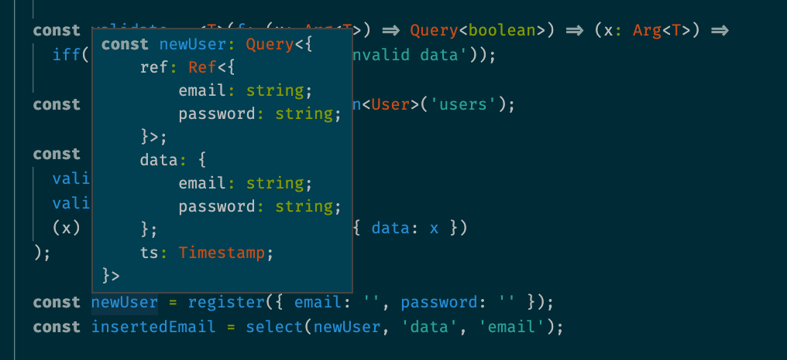
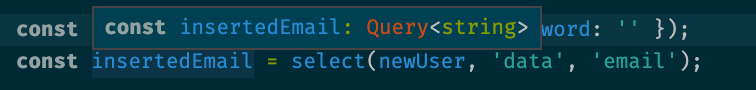

# `fauna-fp`: Functional Programming for [FaunaDB](https://www.fauna.com)

**fql** is clearly a functional programming language, with functions like `map` and `reduce` as first-class tools. Despite that, we don't have all the tooling that is associated with modern functional languages like function composition, parameter currying and strong type inference. `fauna-fp` is a project trying to bridge that gap.

## Vision

To allow writing complex FQL queries using elevant function composition that looks like this:

```js
const emailValidator = compose(q.select("email"), q.containsStrRegex("^.+@.+..+$"));
const passwordValidator = compose(q.select("password"), q.length, q.gte(8));

const validate = (f) => (x) => q.iff(f(x), x, q.abort("invalid data"));

const validateEmail = validate();
const validatePassword = validate(compose());

const register = compose(
  validate(emailValidator),
  validate(passwordValidator),
  (x) => ({ data: x }),
  q.create(usersCollection)
);
```

or, with types:

```ts
interface User {
  email: string;
  password: string;
}

// emailValidator: (x: Arg<{email: string}>) => Query<boolean> (inferred automatically)
const emailValidator = compose(select("email"), containsStrRegex("^.+@.+..+$"));
// passwordValidator: (x: Arg<{password: string}>) => Query<boolean> (inferred automatically)
const passwordValidator = compose(select("password"), length, gte(8));

const usersCollection = collection<User>("users");

const validate = <T>(f: (x: Arg<T>) => Query<boolean>) => (x: Arg<T>) =>
  iff(f(x), x, abort("invalid data")); // inferred as Query<T>

// register : (x: Arg<User>) => Query<Document<User>>;
const register = compose(
  validate(emailValidator),
  validate(passwordValidator),
  (x) => ({ data: x }),
  q.create(usersCollection)
);
```





<details>
  <summary>Plain FQL version</summary>

Here's what the query above might look like in "vanilla" FQL.

```ts
const Validator = (f: (x: ExprArg) => ExprArg) => (x: ExprArg) =>
  q.If(f(x), x, q.Abort("invalid data"));

const PasswordValidator = Validator((x) => q.GTE([8, q.Length(q.Select(["password"], x))]));

const EmailValidator = Validator((x) => q.ContainsStrRegex(q.Select(["email"], x), "^.+@.+..+$"));

const Register = (x: User) =>
  q.Create(q.Collection("users"), {
    data: PasswordValidator(EmailValidator(x)),
  });

const NewUser = Register({ email: "", password: "" });

const Email = q.Select(["data", "email"], newUser);
```

</details>

## Status

Experimental. See some [test files](./src/index.test.ts) for example usage.

I think a critical advantage of this library comes from getting the types right, so I have started there. I did try to add function composition at the same time, but I'm not enough of a TypeScript expert to be able to pull off all the generic shenanigans that are required.

I haven't written analogues for all FQL functions yet, but I've written enough that I'm starting to see dividends in my own codebase. Having strongly-typed queries is really valuable!

## Approach

### Separate Library

To get the benefits of strong typing, it might have been possible to simply write an alternative type definition for the fauna JS client. I have chosen not to do that because I have broader ambitions for `fauna-fp` than just types. Things liks parameter order is inconsistent in FQL (see `Map` and `Reduce` which take data as first and last parameters respectively). Currying wouldn't be possible if I just wrote typedefs. I think we can do better.

## Opaque types

I don't want to expose this library to the particular data structure used by Fauna under-the-hood. Instead, I have created a generic opaque `Query<T>` type which represents the result of computing a query. This type should never be constructed manually - it should only ever be returned by a `fauna-fp` function. Similarly, a `Query` type should never be inspected or used directly (it will appear to only have a `__TYPE__` property upon inspection). Instead, it should be passed to the `fauna-fp` `query` function, which will execute the query and return the actual payload.

These opaque types allow me to represent the conceptual types being represented by the various FQL datatypes, withouot coupling to the internal structure, and while safeguarding myself from future changes to this structure.
